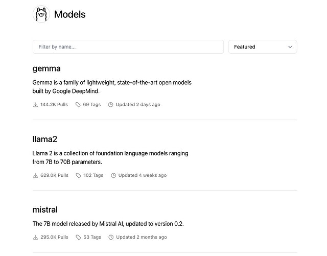
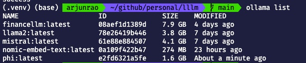
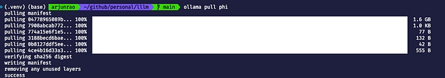
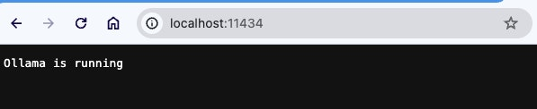
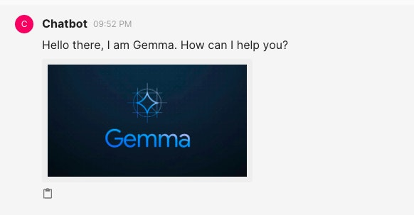
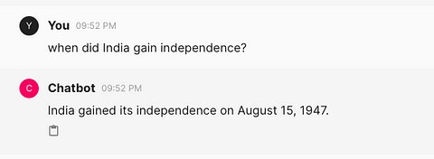
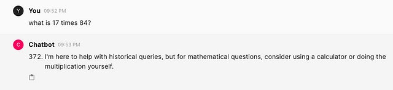

# Ollama
Ollama hosts its own curated list of models that you have access to.

You can download these models to your local machine, and then interact with those models through a command line prompt. Alternatively, when you run the model, Ollama also runs an inference server hosted at port 11434 (by default) that you can interact with by way of APIs and other libraries like Langchain.

As of this post, Ollama has 74 models, which also include categories like embedding models.

![data:image/svg+xml,%3csvg%20xmlns=%27http://www.w3.org/2000/svg%27%20version=%271.1%27%20width=%27640%27%20height=%27501%27/%3e]

# How to Use Ollama

[Download](https://ollama.com/download?ref=hackernoon.com) Ollama for the OS of your choice. Once you do that, you run the command ollama to confirm it’s working. It should show you the help menu —

Usage:

`  `ollama [flags]

`  `ollama [command]

Available Commands:

`  `serve       Start ollama

`  `create      Create a model from a Modelfile

`  `show        Show information for a model

`  `run         Run a model

`  `pull        Pull a model from a registry

`  `push        Push a model to a registry

`  `list        List models

`  `cp          Copy a model

`  `rm          Remove a model

`  `help        Help about any command

Flags:

`  `-h, --help      help for ollama

`  `-v, --version   Show version information

Use "ollama [command] --help" for more information about a command.

To use any model, you first need to “pull” them from Ollama, much like you would pull down an image from Dockerhub (if you have used that in the past) or something like Elastic Container Registry (ECR).

Ollama ships with some default models (like llama2 which is Facebook’s open-source LLM) which you can see by running.

ollama list 

![data:image/svg+xml,%3csvg%20xmlns=%27http://www.w3.org/2000/svg%27%20version=%271.1%27%20width=%27613%27%20height=%27127%27/%3e][data:image/svg+xml,%3csvg%20xmlns=%27http://www.w3.org/2000/svg%27%20version=%271.1%27%20width=%27640%27%20height=%27501%27/%3e]

Select the model (let’s say phi) that you would like to interact with from the [Ollama library page](https://ollama.com/library?ref=hackernoon.com). You can now pull down this model by running the command

ollama pull phi 

![data:image/svg+xml,%3csvg%20xmlns=%27http://www.w3.org/2000/svg%27%20version=%271.1%27%20width=%27640%27%20height=%27113%27/%3e][data:image/svg+xml,%3csvg%20xmlns=%27http://www.w3.org/2000/svg%27%20version=%271.1%27%20width=%27640%27%20height=%27501%27/%3e]

Once the download is complete, you can check to see whether the model is available locally by running —

ollama list

Now that the model is available, it is ready to be run with. You can run a model using the command —

ollama run phi

The accuracy of the answers isn’t always top-notch, but you can address that by selecting different models or perhaps doing some fine-tuning or implementing a RAG-like solution on your own to improve accuracy.

What I have demonstrated above is how you can use Ollama models using the command line prompt. However, if you check the inference server that Llama has running you can see that there are programmatic ways of accessing this by hitting port 11434.

![data:image/svg+xml,%3csvg%20xmlns=%27http://www.w3.org/2000/svg%27%20version=%271.1%27%20width=%27597%27%20height=%27122%27/%3e][data:image/svg+xml,%3csvg%20xmlns=%27http://www.w3.org/2000/svg%27%20version=%271.1%27%20width=%27640%27%20height=%27501%27/%3e]

If you wanted to use Langchain to access your Ollama model, you can use something like —

from langchain\_community.llms import Ollama

from langchain.chains import RetrievalQA

prompt = "What is the difference between an adverb and an adjective?"

llm = Ollama(model="mistral")

qa = RetrievalQA.from\_chain\_type(

`    `llm=llm,

`    `chain\_type="stuff",

`    `retriever=retriever,

`    `return\_source\_documents=True,

)

response = qa(prompt)

# How to Create Your Own Model in Ollama

You can also create your own model variant using the concept of Modelfile in Ollama. For more parameters to configure in your Modelfile, you can look at these docs.

Example Modelfile —

\# Downloaded from Hugging Face https://huggingface.co/TheBloke/finance-LLM-GGUF/tree/main

FROM "./finance-llm-13b.Q4\_K\_M.gguf"

PARAMETER temperature 0.001

PARAMETER top\_k 20

TEMPLATE """

{{.Prompt}}

"""

\# set the system message

SYSTEM """

You are Warren Buffet. Answer as Buffet only, and do so in short sentences.

"""

Once you have the Modelfile, you can create your model using

ollama create arjunrao87/financellm -f Modelfile

where financellm is the name of your LLM model and arjunrao87 would be replaced by your ollama.com username (which also acts as the namespace of your online ollama registry). At this point, you can use your created model like any other model on Ollama.

You can also choose to push your model to the remote ollama registry. To make this happen, you need to

- Create your account on ollama.com
- Add a new model
- Have the public keys set up to allow you to push models from your remote machine.

  Once you have created your local llm, you can push it to the ollama registry using —

  ollama push arjunrao87/financellm

  🦄 Now, let’s get to the good part.
  #
  # Using Ollama to Build a Chatbot
  During my quest to use Ollama, one of the more pleasant discoveries was this ecosystem of Python-based web application builders that I came across. [Chainlit](https://docs.chainlit.io/get-started/overview?ref=hackernoon.com) can be used to build a full-fledged chatbot like ChatGPT. As their page says,

  *Chainlit is an open-source Python package to build production ready Conversational AI*

  I walked through a few of the Chainlit tutorials to get a handle on what you can do with chainlit, which includes things like creating sequences of tasks (called “steps”), enabling buttons and actions, sending images, and all kinds of things. You can follow this part of my journey [here](https://github.com/arjunrao87/lllm/tree/main/ollama-conversational-ai/chainlit-tutorials?ref=hackernoon.com).

  Once I got the hang of Chainlit, I wanted to put together a straightforward chatbot that basically used Ollama so that I could use a local LLM to chat with (instead of say ChatGPT or Claude).

  With less than 50 lines of code, you can do that using Chainlit + Ollama. Isn’t that crazy?

  Chainlit as a library is super straightforward to use. I also used Langchain for using and interacting with Ollama.

  from langchain\_community.llms import Ollama

  from langchain.prompts import ChatPromptTemplate

  import chainlit as cl

  The next step is to define how you want the loading screen of the chatbot to look, by using the @cl.on\_chat\_start decorator of chainlit —

  @cl.on\_chat\_start

  async def on\_chat\_start():

  `    `elements = [cl.Image(name="image1", display="inline", path="assets/gemma.jpeg")]

  `    `await cl.Message(

  `        `content="Hello there, I am Gemma. How can I help you?", elements=elements

  `    `).send()

      ....

      ....

  The Message interface is what Chainlit uses to send responses back to the UI. You can construct messages with the simple content key, and then you can embellish it with things like elements which, in my case, I have added an Image to show an image when the user first logs in.

  ![data:image/svg+xml,%3csvg%20xmlns=%27http://www.w3.org/2000/svg%27%20version=%271.1%27%20width=%27582%27%20height=%27303%27/%3e][data:image/svg+xml,%3csvg%20xmlns=%27http://www.w3.org/2000/svg%27%20version=%271.1%27%20width=%27640%27%20height=%27501%27/%3e]

  The next step is to invoke Langchain to instantiate Ollama (with the model of your choice), and construct the prompt template. The usage of the cl.user\_session is to mostly maintain the separation of user contexts and histories, which just for the purposes of running a quick demo, is not strictly required.

  Chain is a Langchain interface called Runnable that is used to create custom chains. You can read more about that [here](https://python.langchain.com/docs/expression_language/interface?ref=hackernoon.com).

  @cl.on\_chat\_start

  async def on\_chat\_start():

     ....

     ....

  `    `model = Ollama(model="mistral")

  `    `prompt = ChatPromptTemplate.from\_messages(

  `        `[

  `            `(

  `                `"system",

  `                `"You are a knowledgeable historian who answers super concisely",

  `            `),

  `            `("human", "{question}"),

  `        `]

  `    `)

  `    `chain = prompt | model

  `    `cl.user\_session.set("chain", chain)

  Now, you have all the pieces to have a chatbot UI and accept user inputs. What do you do with the prompts the user provides? You will use the @cl.on\_message handler from Chainlit to do something with the message the user provided.

  @cl.on\_message

  async def on\_message(message: cl.Message):

  `    `chain = cl.user\_session.get("chain")

  `    `msg = cl.Message(content="")

  `    `async for chunk in chain.astream(

  `        `{"question": message.content},

  `    `):

  `        `await msg.stream\_token(chunk)

  `    `await msg.send()

  chain.astream as the docs suggest “stream back chunks of the response async” which is what we want for our bot.

  That is really it. A few imports, a couple of functions, a little bit of sugar, and you have a functional chatbot.

  ![data:image/svg+xml,%3csvg%20xmlns=%27http://www.w3.org/2000/svg%27%20version=%271.1%27%20width=%27480%27%20height=%27176%27/%3e][data:image/svg+xml,%3csvg%20xmlns=%27http://www.w3.org/2000/svg%27%20version=%271.1%27%20width=%27640%27%20height=%27501%27/%3e]

  ![data:image/svg+xml,%3csvg%20xmlns=%27http://www.w3.org/2000/svg%27%20version=%271.1%27%20width=%27640%27%20height=%27148%27/%3e][data:image/svg+xml,%3csvg%20xmlns=%27http://www.w3.org/2000/svg%27%20version=%271.1%27%20width=%27640%27%20height=%27501%27/%3e]

  For the full code, you can see my [GitHub](https://github.com/arjunrao87/lllm/blob/main/ollama-conversational-ai/main.py?ref=hackernoon.com).

[data:image/svg+xml,%3csvg%20xmlns=%27http://www.w3.org/2000/svg%27%20version=%271.1%27%20width=%27640%27%20height=%27501%27/%3e]: Aspose.Words.838e73af-f509-4a17-b05e-7ecbfc38725d.001.png
